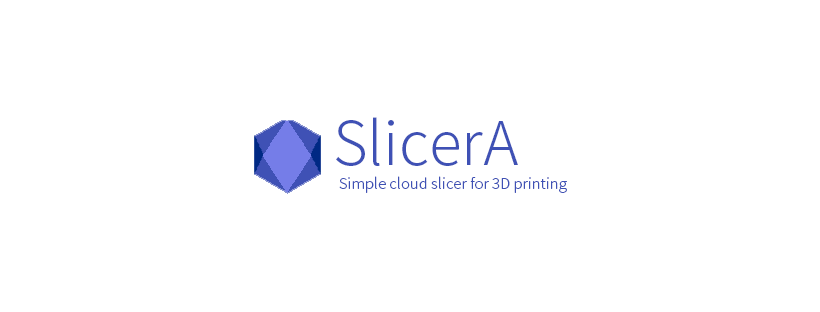
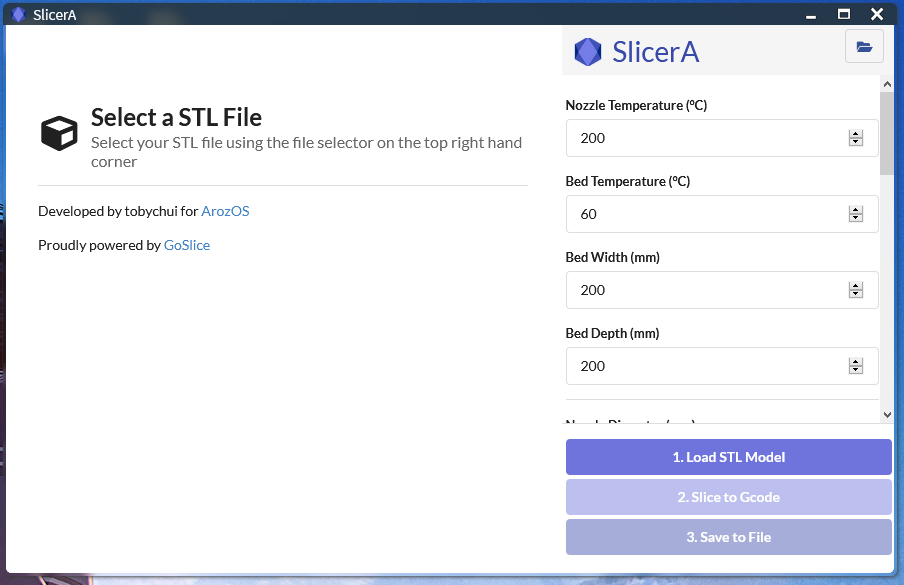
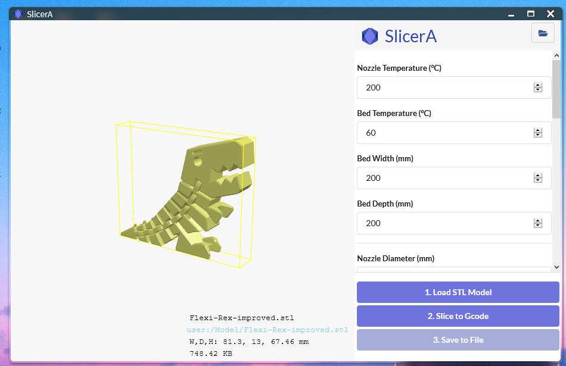
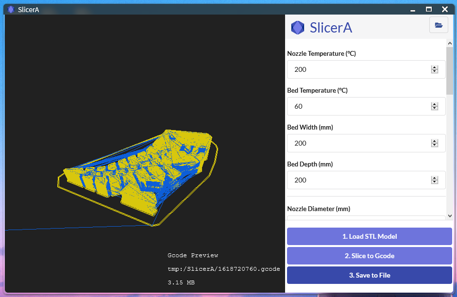
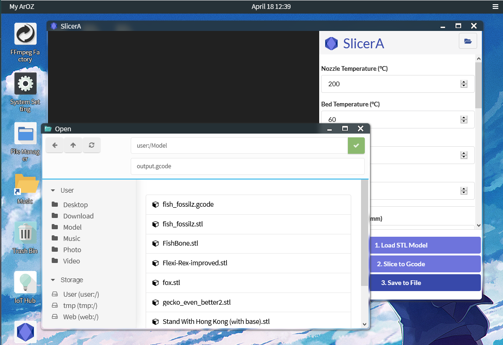
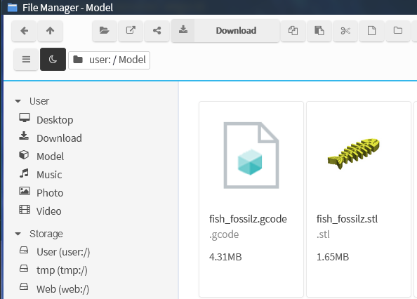
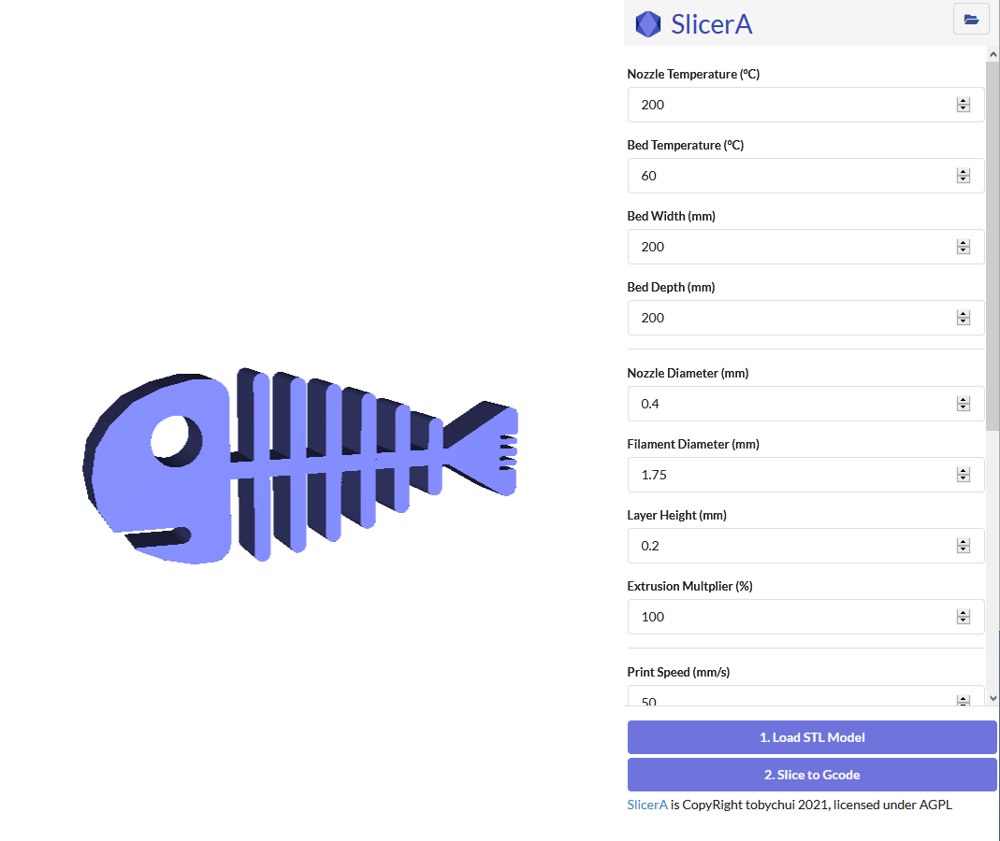

# SlicerA

A web based STL to Gcode slicer for ArozOS

## Installation

### Requirement

- Go 1.15 or above
- Debian Buster on ARM, x64 or Windows on x64 platforms
- [ArozOS](https://github.com/tobychui/arozos) v1.111 or above

### Build

1. Clone this repo into your ArozOS subservice directory (usually can be found under ~/arozos/subservice). 

   ```
   cd ~/arozos/subservice/
   git clone https://github.com/tobychui/SlicerA
   cd SlicerA
   ```

2. Build the SlicerA subservice using the build.sh bash script

   ```
   ./build.sh
   
   # Optional, depends on your permission settings
   sudo chmod 755 -R ./
   ```

3. Restart arozos  using systemctl 

   ```
   sudo systemctl restart arozos
   ```


## Usage

### Use as ArozOS Subservice

To use SlicerA, you can first upload some STL files to your ArozOS cloud desktop and follow the steps below

1. Load STL Model using the top right hand corner button or the "1. Load STL Model " button
2. Click "Slice to Gcode". Wait until it complete and check the finished gcode for any issues in slicing
3. Click "Save to File" if the gcode file looks good.

### Use as standalone web application

To use SlicerA without ArozOS, build the application with standard go building procedures. 

```
cd ./SlicerA
go build
```

Next, start the application with the following command

```
./SlicerA
>> SlicerA started. Listening on :80
```

Then, navigate to http://localhost for using the standalone web slicer interface. 

You can also change the port where it listen to using  - port flag as follows

```
./SlicerA -port :8080
```

**Due to AGPL limitation, there is no Gcode previewer in the standalone mode.  Gocde file will be downloaded directly when you press the "Slice to Gcode" button.**


## Screenshots













And after export, you can see your gcode file in the location you selected.




Interface under standalone mode



## License

Please see the LICENSE file


### Special Thanks

This project is powered by the amazing Golang written STL to Gcode slicer named [GoSlice](https://github.com/aligator/GoSlice)

The STL Viewer in standalone mode is powered by [viewstl](https://github.com/omrips/viewstl) licensed under MIT. See web/script/viewstl/LICENSE for more information.

